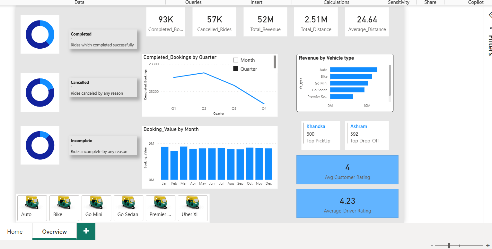

# Uber Ride Analytics Dashboard

## Project Overview

This project analyzes Uber ride booking data using Power BI to provide insights into booking performance, revenue generation, ride completion rates, vehicle performance, customer satisfaction, and operational efficiency.

The dashboard was designed to visualize key business metrics and identify trends that can support data-driven decision-making.

---

## Business Problem

Ride-hailing companies need visibility into:

- Booking performance
- Revenue generation
- Ride completion rates
- Vehicle category performance
- Customer satisfaction
- Driver performance
- Seasonal demand patterns

This dashboard provides a centralized view of operational and business KPIs.

---

## Tools Used

- Power BI
- DAX
- Excel
- Data Visualization

---

## Dashboard Features

### KPI Monitoring

The dashboard tracks:

- Total Bookings
- Completed Rides
- Cancelled Rides
- Total Revenue
- Total Distance
- Average Distance per Ride

---

### Ride Status Analysis

Booking outcomes are categorized into:

- Completed
- Cancelled
- Incomplete

This allows management to monitor operational efficiency and identify service delivery challenges.

---

### Revenue Analysis

Revenue performance is analyzed by:

- Vehicle Type
- Month
- Quarter

The dashboard helps identify the most profitable service categories and seasonal revenue trends.

---

### Vehicle Performance Analysis

The dashboard compares revenue generated by different vehicle categories, including:

- Auto
- Bike
- Go Mini
- Go Sedan
- Premier Sedan
- Uber XL

This enables stakeholders to understand which vehicle categories contribute most to revenue.

---

### Customer & Driver Experience

The dashboard includes:

- Average Customer Rating
- Average Driver Rating

These KPIs provide visibility into service quality and customer satisfaction.

---

### Location Insights

The dashboard identifies:

- Top Pickup Location
- Top Drop-off Location

These insights support operational planning and demand forecasting.

---

## Key Insights

### Revenue Performance

- Total Revenue exceeded 52 Million.
- Revenue contribution varies significantly across vehicle categories.
- Auto and Bike categories generated the highest revenue.

### Ride Operations

- Over 93,000 bookings were successfully completed.
- Approximately 57,000 rides were cancelled.
- Monitoring cancellation rates can help improve operational performance.

### Customer Experience

- Average Customer Rating: 4.00
- Average Driver Rating: 4.23

Overall ratings indicate positive user experiences.

### Demand Trends

- Booking values remained relatively stable throughout the year.
- Quarterly analysis shows fluctuations in completed bookings, highlighting seasonal demand patterns.

---

## Dashboard Preview

### Overview Dashboard



---

## Skills Demonstrated

### Data Analysis

- KPI Development
- Trend Analysis
- Performance Monitoring
- Business Intelligence

### Power BI

- Interactive Dashboards
- DAX Measures
- Data Modeling
- Data Visualization

### Business Analytics

- Revenue Analysis
- Customer Analytics
- Operational Analytics
- Location Analysis

---

## Repository Structure

```text
uber-ride-analytics-dashboard

│
├── Dashboard
│   └── Uber_Ride_Analytics.pbix
│
├── Dataset
│   └── uber.xlsx
│
├── Images
│   └── dashboard_overview.png
│
└── README.md
```

---

## Business Recommendations

1. Investigate the causes of ride cancellations and implement mitigation strategies.

2. Prioritize high-performing vehicle categories that generate the greatest revenue.

3. Monitor customer and driver ratings continuously to maintain service quality.

4. Use location insights to optimize vehicle allocation and improve service availability.

5. Analyze seasonal booking trends to improve demand forecasting and operational planning.

---

## Author

**V Muriithi**


